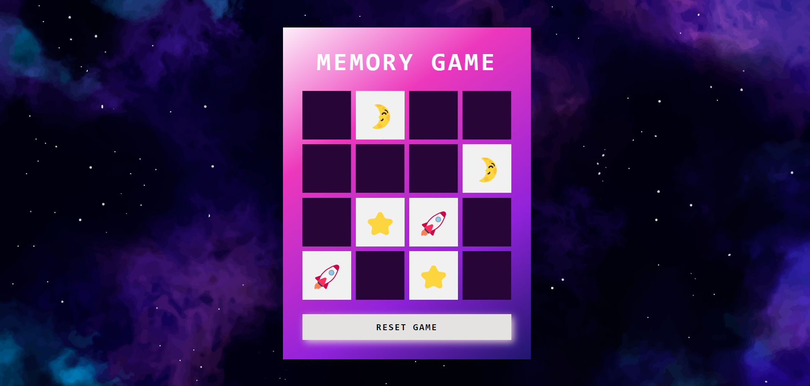

# Memory Game

Project developed at the Game Development Bootcamp.
Classic memory game.

To play, [click here](https://maripirczak.github.io/memory-game/). 

   

## Technologies Used

- HTML5 and CSS3 for structuring the web page and styling the game interface.
- JavaScript to implement game logic and interactivity.
